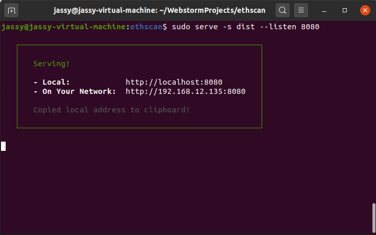

# ethscan

安装依赖：

```node
npm install
```

运行：

```
npm run serve
```


或者通过 `npm run build`编译生成静态资源dist（已同步推送到github中）

```
npm run build
```

先安装静态部署工具serve

```
npm install -g serve
```

然后通过serve指定一个端口部署

```
serve -s dist --listen 8080
```


